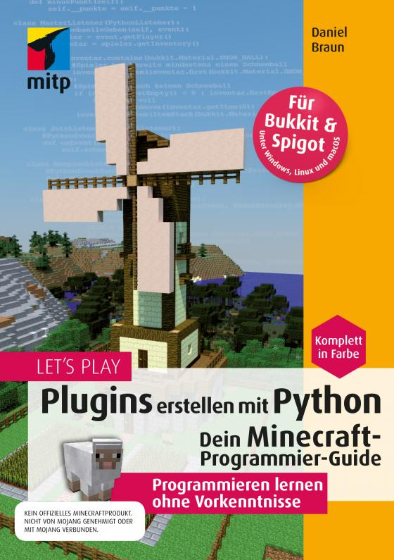
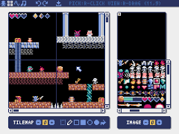

# Einführung in die Programmierung: Tutorat Navon - Erweiternde Lernressourcen zu der Vorlesung
Die Ressourcen werden ungefähr in absteigendem Schwierigkeitsgrad angezeigt. 
**Achtung: Alle Ressourcen und Ideen sind keinesfalls als Ersatz für die Vorlesung und die
Übungsaufgaben gedacht, sondern als Ergänzung!**

  
<i>Click me: Tipps zur Umgang mit der Seite</i>

  Fühlen sich die Vorlesungsinhalte zu schwer an und du schaffst kaum eine Teilaufgabe ohne ganz viel Hilfe von ChatGPT und co.? Oder willst du aus sonstwelchen Gründen Grundkenntnisse aus der Vorlesung ausführlicher vertiefen und dabei vielleicht sogar ein bisschen Spaß haben?
Hier sind ein paar Ressourcen und Ideen, die dir dabei helfen könnten.
Mein Tipp: Nimm dir 1-2 Stunden unter der Woche und gehe einer der empfohlenen Tätigkeiten
oder einer Mischung daraus nach (z. B. 30 Minuten Online-Lehrgang und 1,5 Stunden ein eigenes Projekt).

 

## Eigene Projekte: Vibe-Coding
  

    
<i>Click me: Tipps zur Umsetzung: eigene Projekte</i>

    Solche Projekte sind häufig für Anfänger*innen sehr kompliziert. Da empfiehlt sich, LLMs wie ChatGPT und co. zur Hilfe heranzuziehen. Das Schöne ist: Auch wenn du die KI dir fast den ganzen Code schreiben lässt, wirst du wahrscheinlich viel lernen, wenn du den Code liest und (im Dialog mit der KI) nachvollziehst. Das wirst du in den meisten Fällen ohnehin tun müssen, weil du meistens Sachen am Code modifizieren wollen wirst und dafür der KI sagen musst, an welchen Stellen du es anders haben willst und wie genau. Am besten modifizierst du den Code (mithilfe von Hinweisen statt direkten Lösungen der KI) gleich selbst.
  

  + **Für Zocker*innen: Plugins und Mods für existierende Computerspiele - aber am besten gleich in Python!**
    
	
      
<i>Click me: Tipps zur Umsetzung</i>

      Viele der beliebten und weit verbreiteten Spiele erlauben kein Modding oder Plug-Ins in Python, sondern nur in anderen Sprachen 
	(C++, C#, JS, Java, Lua...). Ich würde eher davon abraten, parallel zur Einführung in die Programmierung eine weitere Sprache
	zu lernen, weil die Syntax-Unterschiede verwirrend sind und den Lernprozess für Python auszögern könnten. Vor allem, wenn man
	ohnehin Schwierigkeiten hat, der Vorlesung zu folgen. Für Spiele, die Java-Mods akzeptieren, kann man Python-Code schreiben und mithilfe von Jython in Java transpilieren 	(= 'übersetzen'). Ähnlich lässt sich auch mithilfe von Transcrypt oder Rapydscript Python-Syntax in Javascript-Code übersetzen für Spiele, die Javascript-Mods erlauben.	

	+ Minecraft-Plugins mit Python   Hierzu gibt es sogar eine Buch-Anleitung, die in der Bibliothek der Pädagogischen Hochschule Freiburg verfügbar ist ("Programmieren lernen mit Python und Minecraft"). Oder frag mich privat nach einer Kopie, die ich dir ausleihen kann.
    

    
	

	+ Andere Spiele (experimentell - ich habe keine Erfahrung damit): Du kannst gucken, ob eines der Spiele, die du magst, Python-, Java- oder Javascript-Mods akzeptiert. Meine Empfehlung: Java- und JS-Mods in Python schreiben und mit Jython bzw. Transcrypt / Radyscript in die Zielsprache umwandeln. Ein paar Beispiele sind:
    	+ The Sims 4
     	+ Civilization IV
      	+ World of Tanks
      	+ GTA V
      	+ Red Dead Redemption 2
      	+ Mindustry

  + **Mini-Programme, die dir im Alltag oder im Studium helfen**:
   
 
	
<i>Click me: Tipps zur Umsetzung</i>

	   Wähle am besten Mini-Projekte, wo du nicht viel mit Programm-externen Problemen kämpfen musst, sondern dich auf die Programmlogik und die Syntax konzentrieren kannst. Zum Beispiel führen Programme für deinen Mail-Account (z. B. Rechnungssammler und -sortierer oder ein zusätzlicher Spam-Checker) schnell zum stundenlangen Rumfummeln an Einstellungen auf deiner Mail-Seite, damit dein Programm überhaupt erst Zugriff auf deine Mails erhält... Vermeide also vielleicht besser den Zugriff auf private und geschützte Inhalte. Die Arbeit mit öffentlich frei zugänglichen Seiten dürfte viel weniger Probleme darstellen und eignet sich auch gut für Mini-Python-Projekte. Hier sind ein paar Beispiele: 

    - Immer wiederkehrende Copy-Paste-Operationen bei Dokumentbearbeitung automatiseren
    - Linksammlungen auf Aktualtität der einzelnen Links überprüfen
    - Dateien auf deinem Computer (z. B. Downloads) automatisch in einer Ordnerstruktur ordnen
 

## Retro-Spiele erstellen mit Pyxel
Diese Engine ist einfacher als andere typische Engines wie Pygame. Außerdem ist die Engine so gestaltet, dass Bild- und Sounderstellung besonders einfach ist, sodass der Fokus auf das Code-Schreiben gelegt werden kann, statt sich mit Bilderstellungsprogrammen zu plagen. Projekte in der Engine sind code-technisch ähnlich schwer wie die Vorlesung, aber es ist potenziell sehr motivierend, ganze Spiele selbst von Grund auf zu entwickeln. Du kannst die Spiele sogar mit wenig Aufwand in HTML-Format überbringen und online mit deinen Freunden teilen, z. B. über Github-Pages. Dann bekommst du als kleiner Bonus auch ein bisschen Einblicke in Git. 
Ich würde mit dem Youtube-Tutorial anfangen und mich dann von Projekten auf der Github-Seite inspirieren lassen. Bei Fragen und Problemen hilft die Github-Seite und ChatGPT und co...
[Youtube-Anleitung](https://www.youtube.com/watch?v=gXpe9HZ3Au8&list=PLp_k-oh2bNHairxWQK_SYL5Me_OBJYJs8) 
[Github-Seite](https://github.com/kitao/pyxel) 

## Online-Lehrgänge
Aufgaben, die man direkt im Browser löst. Die Aufgaben sind kleinschrittiger und einfacher als in der Vorlesung. Gedacht für Studierende, die die absoluten Python-Basics systematisch wiederholen und üben wollen. 
+ [algo.bwinf](https://algo.bwinf.de/): Eine Seite von den Bundesweiten Informatikwettbewerben (BWINF) für Schüler*innen, gefördert vom Bundesministerium für Bildung. Sehr nett aufbereitet, aber ein eher kurzer Lehrgang. 
+ [Trainingsaufgaben vom Jugendwettbewerb Informatik](https://jwinf.de/contest/training): Ebenso ein Angebot der BWINF für Schüler*innen. Der Kurs ist zu großen Teilen sehr niederschwellig, wird aber gegen Ende ziemlich anspruchsvoll. Es werden folgende Konzepte geübt: Funktionen aufrufen, if-Verzweigungen, while-Schleifen, for-Schleifen, einfache String-Operationen.
